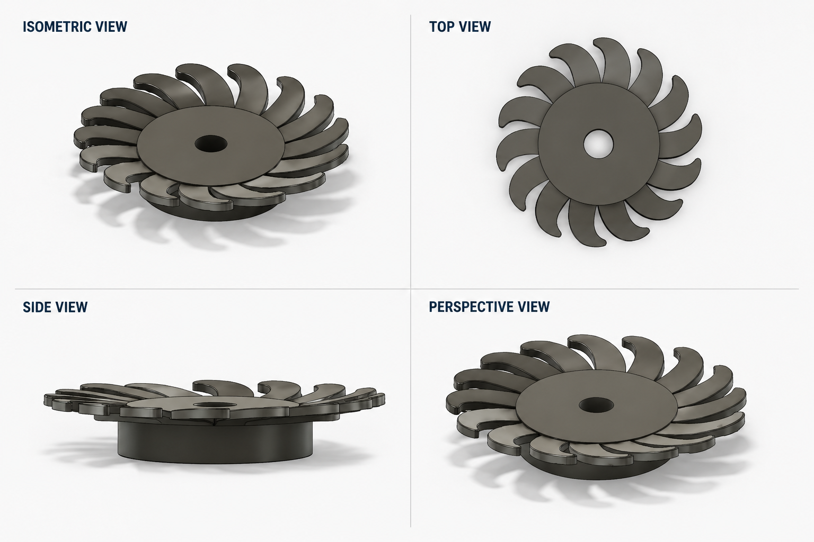

# Jet Engine Compressor Fan

A 3D CAD model of a jet engine compressor fan created in Autodesk Fusion 360.
## Preview

## Project Overview
This project focuses on creating a detailed compressor fan model while practicing CAD modeling fundamentals such as sketches, revolves, patterns, and component design.

## Software Used
- Autodesk Fusion 360

## Skills Demonstrated
- 3D CAD Modeling
- Parametric Design
- Circular Pattern
- Mechanical Design Fundamentals

## Project Files

The complete Fusion 360 model is available through the shared Fusion 360 cloud link below.

🔗 **Fusion 360 Design:** [View Model](https://a360.co/4yvhV6a)
